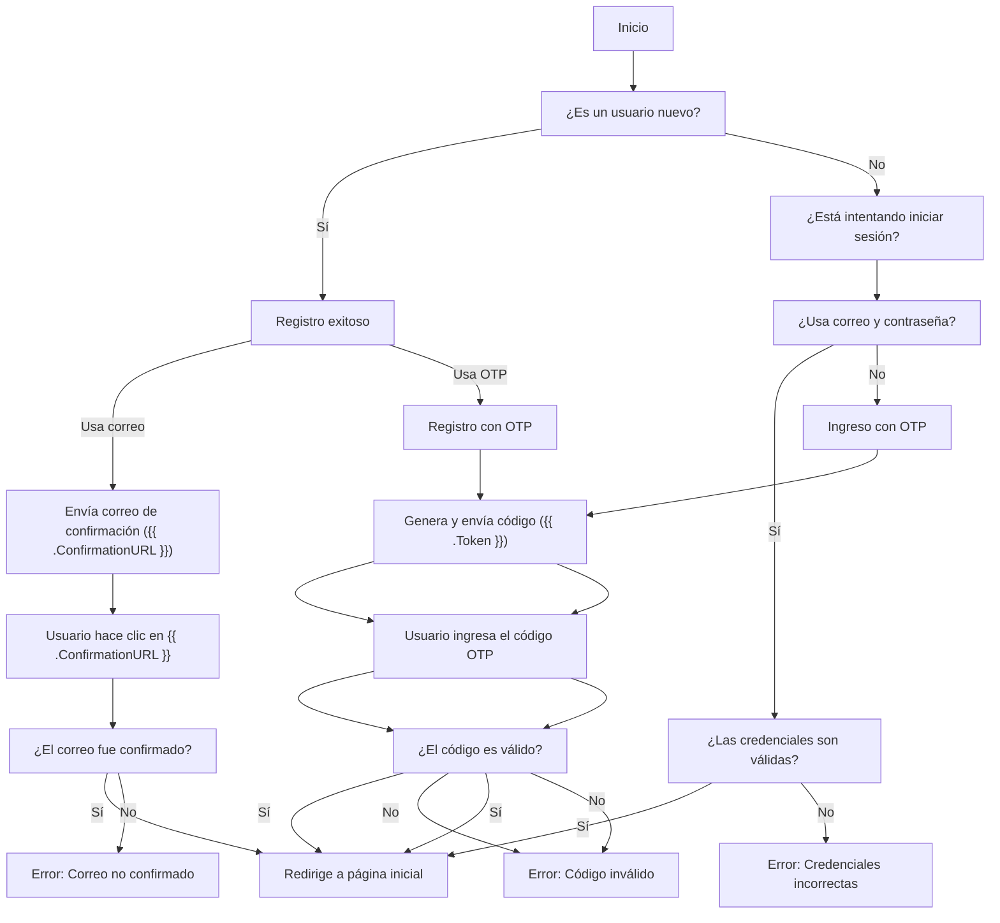

```mermaid
graph TD
    Inicio["Inicio"]
    EsNuevoUsuario["¿Es un usuario nuevo?"]
    Registro["Registro exitoso"]
    InicioSesion["¿Está intentando iniciar sesión?"]
    CorreoPassword["¿Usa correo y contraseña?"]
    OTPLogin["Ingreso con OTP"]
    OTPRegistro["Registro con OTP"]
    EnviaCorreo["Envía correo de confirmación ({{ .ConfirmationURL }})"]
    ClicCorreo["Usuario hace clic en {{ .ConfirmationURL }}"]
    CorreoConfirmado["¿El correo fue confirmado?"]
    GeneraOTP["Genera y envía código ({{ .Token }})"]
    IngresaOTP["Usuario ingresa el código OTP"]
    CredencialesValidas["¿Las credenciales son válidas?"]
    CodigoValido["¿El código es válido?"]
    ErrorCorreo["Error: Correo no confirmado"]
    ErrorCodigo["Error: Código inválido"]
    ErrorCredenciales["Error: Credenciales incorrectas"]
    RedirigePagina["Redirige a página inicial"]

    Inicio --> EsNuevoUsuario
    EsNuevoUsuario -->|Sí| Registro
    EsNuevoUsuario -->|No| InicioSesion
    Registro -->|Usa correo| EnviaCorreo
    EnviaCorreo --> ClicCorreo
    ClicCorreo --> CorreoConfirmado
    CorreoConfirmado -->|Sí| RedirigePagina
    CorreoConfirmado -->|No| ErrorCorreo
    Registro -->|Usa OTP| OTPRegistro
    OTPRegistro --> GeneraOTP
    GeneraOTP --> IngresaOTP
    IngresaOTP --> CodigoValido
    CodigoValido -->|Sí| RedirigePagina
    CodigoValido -->|No| ErrorCodigo

    InicioSesion --> CorreoPassword
    CorreoPassword -->|Sí| CredencialesValidas
    CredencialesValidas -->|Sí| RedirigePagina
    CredencialesValidas -->|No| ErrorCredenciales
    CorreoPassword -->|No| OTPLogin
    OTPLogin --> GeneraOTP
    GeneraOTP --> IngresaOTP
    IngresaOTP --> CodigoValido
    CodigoValido -->|Sí| RedirigePagina
    CodigoValido -->|No| ErrorCodigo
```